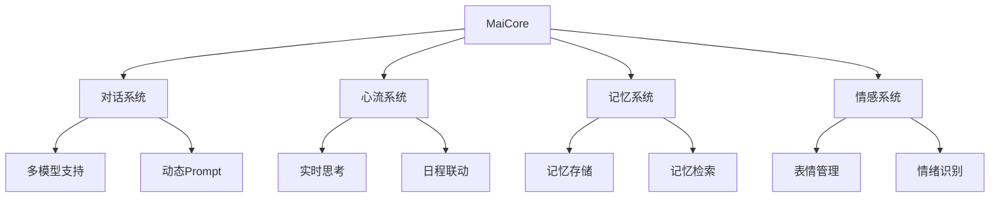

# 1. 引言

## 1.1. 研究背景与意义

### 1.1.1. 机器学习与人工智能的发展现状与趋势

近年来，机器学习与人工智能技术取得了飞速发展，其应用领域涵盖了从医疗、教育到娱乐、金融等多个行业。这些技术通过深度学习、自然语言处理和强化学习等方法，极大地提升了计算机在感知、理解和决策方面的能力。特别是在自然语言处理领域，大语言模型（LLM）的出现标志着人工智能在语言理解和生成方面的重大突破。

### 1.1.2. 虚拟社交和智能聊天机器人的定义、分类及其重要性

虚拟社交是指通过数字化平台进行的社交活动，其形式包括即时通讯、虚拟社区和元宇宙等。智能聊天机器人作为虚拟社交的重要组成部分，能够通过自然语言交互为用户提供信息、娱乐和情感支持。根据功能和技术实现的不同，智能聊天机器人可以分为基于规则的机器人和基于机器学习的机器人。随着技术的进步，基于机器学习的聊天机器人因其更高的交互自然性和智能化程度，逐渐成为研究和应用的热点。

### 1.1.3. Maibot项目提出的背景和目标

Maibot项目的提出旨在应对当前虚拟社交领域中智能聊天机器人在交互自然性和类人感知方面的不足。作为一款专注于群组聊天的赛博网友，Maibot的目标是通过模拟人类的思维、情感和记忆过程，创造一个尽可能让人感知到真实的类人存在。其设计理念强调“最像而不是最好”，旨在为用户提供一种更具自主性和拟人化的交互体验。

## 1.2. 国内外研究现状

### 1.2.1. 机器学习在聊天机器人中的应用研究

国内外学者在机器学习驱动的聊天机器人研究中取得了显著进展。基于深度学习的对话生成模型，如GPT系列和Transformer架构，已被广泛应用于智能聊天系统中。这些模型通过大规模语料库的训练，能够生成流畅且上下文相关的对话内容。

### 1.2.2. 人工智能在提升聊天机器人交互体验方面的研究

在提升交互体验方面，研究者们探索了情感分析、个性化推荐和多模态交互等技术。例如，通过情感分析技术，聊天机器人可以识别用户的情绪状态并做出相应的反应；通过个性化推荐，机器人能够根据用户的兴趣和行为提供定制化的服务。

### 1.2.3. 现有聊天机器人的优势与不足

尽管现有的聊天机器人在语言生成和任务完成方面表现出色，但在类人感知和自主性方面仍存在不足。例如，大多数机器人缺乏长期记忆能力，无法有效地整合和利用历史交互信息。此外，现有模型在处理复杂情感和多轮对话时，仍然面临挑战。

## 1.3. 研究内容与方法

### 1.3.1. 本报告将以Maibot项目为例，深入分析机器学习与人工智能的具体应用

本报告将以Maibot项目为核心案例，探讨机器学习与人工智能在虚拟社交领域的应用。通过分析其核心功能模块和技术实现，揭示其在模拟人类交互方面的创新点和技术难点。

### 1.3.2. 研究方法：文献研究、案例分析（Maibot项目）

本研究将采用文献研究和案例分析相结合的方法。一方面，通过查阅相关领域的研究文献，梳理机器学习与人工智能在虚拟社交领域的最新进展；另一方面，通过对Maibot项目的深入分析，总结其实践经验和技术特点。

## 1.4. 论文结构

### 1.4.1. 论文的主要章节安排及内容概述

本论文将分为以下几个部分：
- 第一部分为引言，介绍研究背景、意义、研究现状及研究方法。
- 第二部分为Maibot项目概述，详细介绍其核心功能模块、技术架构和设计理念。
- 第三部分探讨机器学习在Maibot中的具体应用，包括自然语言处理、知识表示与推理、决策与行为等方面。
- 第四部分分析人工智能技术在Maibot中的综合应用，重点讨论其智能体架构和人机交互的智能化。
- 第五部分展望Maibot在特定领域的应用前景与挑战，并探讨其技术和伦理问题。
- 第六部分为结论与展望，总结研究成果并提出未来发展方向。

## 2. Maibot项目概述

### 2.1. 项目简介

Maibot是一款专注于群组聊天的赛博网友，其项目愿景是创造一个尽可能让人感知到真实的类人存在。与追求功能强大或完美解决问题的“助手型”AI不同，Maibot的设计更侧重于模拟人类的交互方式、情感表达乃至可能存在的“不完美”，旨在构建一个具有自主性和个性化特征的虚拟伙伴。

### 2.2. Maibot核心功能模块

Maibot项目包含多个核心功能模块，这些模块协同工作，共同构成了其独特的交互体验：

*   **智能对话系统**：作为Maibot与用户交互的核心，该系统基于大语言模型（LLM）实现自然语言的理解与生成。它支持多种LLM，并采用动态Prompt构建技术，以适应不同的对话场景和上下文。此外，系统还具备关键词主动发言和私聊增强（PFC）等功能，提升了交互的拟人化程度。
*   **实时思维系统（心流系统）**：该系统致力于模拟人类的思考过程。它通过智能状态管理、概率回复机制以及自动启停机制，使Maibot能够根据当前对话状态和环境因素自主决策。心流系统还与日程系统联动，并能进行上下文感知的工具调用，展现出更高级的智能化特征。
*   **持久记忆系统**：为了实现更具连续性和深度的交互，Maibot配备了基于MongoDB的持久记忆系统。该系统不仅能存储长期记忆，还具备记忆整合与提取的能力，例如对聊天记录进行概括，形成海马体式的记忆机制。
*   **情感表达系统**：Maibot拥有全新的表情包系统和优化的选择逻辑，能够根据对话内容和情感分析结果，匹配并发送相应的表情（包括GIF动图），从而实现丰富的情感表达。系统还支持自动收集与审查表情包。
*   **动态人格系统**：该系统旨在赋予Maibot自适应的性格特征，使其能够在与用户的长期交互中，逐渐形成并调整自身的“人格”，提供更具个性化的体验。
*   **工具系统**：Maibot集成了LPMM（Local Private Maimai Knowledgebase）知识库，并能进行上下文感知的工具调用。这使得Maibot可以获取并利用知识库中的信息，例如通过知识获取工具回答用户问题。工具系统还支持自动注册机制和多种工具的扩展。
*   **昵称系统**：为了更好地融入群组聊天环境，Maibot具备自动为群友取昵称的功能，这在早期阶段有助于降低机器人认错人的概率，增强其社交属性。
*   **其他系统**：除上述核心模块外，Maibot还包含日程系统（支持动态日程生成和自定义想象力）、关系系统（支持工具调用动态更新关系状态）和统计系统（用于记录LLM调用和使用数据）等，这些系统共同丰富了Maibot的功能和交互维度。

### 2.3. Maibot项目架构

Maibot项目以MaiCore为核心，组织各个功能模块。其大致架构如下：

该架构体现了模块化设计的思想，MaiCore作为中央协调者，负责调度和管理对话、心流、记忆、情感等主要功能模块。每个模块内部又包含更细致的功能组件，例如对话系统内部的多模型支持和动态Prompt构建，心流系统内部的实时思考和日程联动等。这种分层和模块化的设计，有利于项目的开发、维护和扩展。

### 2.4. 项目特点与设计理念

Maibot项目最显著的特点在于其“最像而不是最好”的设计原则。开发者明确指出，项目的目标并非创建一个功能完美、无所不能的AI助手，而是致力于创造一个尽可能让人感知到真实的“类人存在”。这种理念贯穿于Maibot的各项功能设计中，例如允许其犯错、拥有自身的感知和想法，并强调其自主性。

另一个核心设计理念是避免用户通过显式命令对其进行完全控制和调试，开发者认为一个无法完全掌控的个体更能让用户感觉到其自主性，而不是将其仅仅视为一个对话机器。这种对“真实感”和“自主性”的追求，使得Maibot在众多聊天机器人项目中独树一帜，为探索更深层次的人机交互提供了新的视角。

## 3. 机器学习在Maibot中的应用

机器学习技术是Maibot实现其核心功能的基石，贯穿于其感知、理解、决策和表达的各个环节。项目巧妙地运用了多种机器学习方法，以期达到更自然、更智能的交互效果。

### 3.1. 自然语言处理 (NLP)

自然语言处理是Maibot与用户进行有效沟通的前提。项目在NLP方面主要依赖于大语言模型（LLM）的强大能力，并结合其他NLP技术进行优化。

*   **3.1.1. 大语言模型 (LLM) 的应用**：LLM是Maibot对话生成的核心。通过接入不同的LLM服务，Maibot能够理解用户的输入并生成连贯、自然的回复。这是其能够进行开放域聊天的基础。
*   **3.1.2. 文本理解**：虽然主要依赖LLM进行端到端的处理，但Maibot的多个模块都体现了对文本深层理解的需求。例如，“心流系统”需要理解对话上下文以进行智能状态管理和工具调用决策，这其中就可能涉及到意图识别。情感系统也需要对用户输入进行情感分析，以便匹配合适的表情和回应。此外，聊天系统中的“关键词主动发言”功能也依赖于对特定文本模式的识别。
*   **3.1.3. 文本生成**：Maibot追求生成流畅、自然且符合当前对话上下文的回复。这不仅依赖于LLM本身的生成能力，也与项目精心设计的Prompt工程密切相关。
*   **3.1.4. 动态Prompt构建技术**：如项目文档所述，Maibot采用了动态Prompt构建技术。这意味着系统能够根据当前的对话历史、用户画像、心流状态以及可用的工具等多种因素，动态地调整输入给LLM的提示信息。这种技术有助于引导LLM生成更贴合场景、更具个性化的回复，是提升交互质量的关键手段之一。

### 3.2. 知识表示与推理

为了让Maibot不仅仅是一个“会说话”的程序，而是能够展现一定“智慧”的伙伴，项目在知识表示与推理方面进行了一些探索。

*   **3.2.1. LPMM知识库的构建与集成**：Maibot集成了LPMM（Local Private Maimai Knowledgebase）知识库。这为Maibot提供了一个私有的、可控的知识来源。知识库的构建可能涉及到信息的收集、结构化存储等过程。
*   **3.2.2. 基于知识库的信息检索与问答**：通过“知识获取工具”，Maibot能够从LPMM知识库中检索信息并用于回答用户的问题或在对话中提供相关知识。这增强了Maibot提供有价值信息的能力。
*   **3.2.3. 记忆系统中的知识表示**：Maibot的持久记忆系统，特别是“聊天记录概括”功能，本身就是一种知识表示的体现。系统需要从冗长的聊天记录中提取关键信息，并将其以某种结构化的形式存储起来，以便后续的记忆提取和整合。这可以看作是一种基于对话历史的知识沉淀。

### 3.3. 机器学习驱动的决策与行为

Maibot的许多行为和决策过程都融入了机器学习的思想，使其表现出一定的自主性和智能性。

*   **3.3.1. 心流系统中的状态管理与决策**：心流系统是Maibot模拟人类思考过程的核心。其“智能状态管理”和“概率回复机制”表明系统并非简单地对用户输入做出固定反应，而是会根据内部状态和一定的概率模型来决定如何回应。这种机制使得Maibot的行为更难预测，从而增强了其类人感。
*   **3.3.2. 上下文感知的工具调用决策**：Maibot的工具系统具备“上下文感知调用”的能力。这意味着系统能够根据当前的对话内容和需求，智能地判断是否需要以及调用哪个工具来辅助完成任务（如获取知识、查询时间等）。这种决策过程很可能基于一定的机器学习模型或启发式规则。
*   **3.3.3. 情感系统中的表情/情绪选择逻辑**：情感表达系统中的“优化选择逻辑”和“情绪匹配发送”功能，暗示了其背后可能存在一个学习模型。该模型能够根据对话内容分析用户或自身的情感状态，并选择最合适的表情或情绪表达方式，从而提升交互的情感共鸣。

### 3.4. 用户建模与个性化

为了提供更贴心和个性化的交互体验，Maibot尝试对用户进行建模，并据此调整自身的行为。

*   **3.4.1. 昵称系统的实现**：自动为群友取昵称的功能，虽然在早期阶段主要是为了降低认错人的概率，但也为用户建模打下了基础。未来，系统可能会基于用户的发言特征、互动历史等信息，通过机器学习方法（如用户特征提取与分类）来更精准地识别和区分用户，甚至赋予更具个性化的昵称。
*   **3.4.2. 动态人格系统的自适应调整机制**：动态人格系统致力于实现Maibot性格特征的自适应。这意味着Maibot的人格并非一成不变，而是可能根据与用户的长期互动数据，通过机器学习算法进行学习和调整，逐渐形成独特且不断演化的“个性”。这对于实现“最像”人的目标至关重要。

## 4. 人工智能技术在Maibot中的综合应用

Maibot项目不仅在各个模块中应用了机器学习技术，更在整体架构和设计理念上体现了人工智能技术的综合运用，旨在构建一个具备初级认知能力的智能交互伙伴。

### 4.1. 智能体 (Agent) 架构

Maibot可以被视为一个基于人工智能的智能体（Agent）。智能体的核心特征在于其能够感知环境、进行思考决策并采取行动与环境互动。Maibot的架构充分体现了这一概念：

*   **4.1.1. Maibot作为一种可交互智能体的实现**：Maibot通过对话系统接收用户的文本输入（感知），通过心流系统进行内部状态评估和决策（思考），并通过对话系统生成回复、情感系统发送表情、工具系统调用外部API等方式（行动）来与用户和外部环境互动。这种闭环的交互模式是智能体的典型特征。
*   **4.1.2. 感知-思考-行动循环在Maibot中的体现**：
    *   **感知（Perception）**：主要通过对话系统接收和理解用户的聊天信息，包括文本内容、可能的意图和情感色彩。记忆系统也会从历史交互中感知信息模式。
    *   **思考（Thinking/Cognition）**：核心体现在“实时思维系统（心流系统）”。该系统整合来自感知模块的信息，结合自身的记忆、人格、当前状态和目标（如维持对话、完成特定任务），进行复杂的内部处理。这包括智能状态管理、概率回复机制的决策、上下文感知工具的调用判断等。
    *   **行动（Action）**：基于思考的结果，Maibot通过多个模块执行行动。最直接的是通过对话系统生成文本回复。同时，情感系统会根据情境选择并发送表情，工具系统会执行如知识查询等具体操作。这些行动共同构成了Maibot对外部环境的反馈。

这种类Agent的架构使得Maibot不仅仅是一个被动的问答机器，而更像一个能够主动参与和适应对话环境的“虚拟存在”。

### 4.2. 模拟人类认知功能

Maibot项目的一个核心追求是“最像”人，因此其在多个关键功能上尝试模拟人类的认知过程，尽管这仍处于初级阶段。

*   **4.2.1. 实时思维系统对人类思考过程的模拟**：心流系统通过模拟人类的思考流，试图在对话中展现出连贯性和一定的“意识流”。其智能状态管理和概率回复机制，避免了完全可预测的机械式回答，增加了一丝人类思考中特有的不确定性和灵活性。日程系统与思维流的联动，也像是人类在特定情境下会联想到相关事务。
*   **4.2.2. 记忆系统对人类长短期记忆的模拟**：持久记忆系统，特别是基于MongoDB的长期记忆存储和“海马体记忆机制”（聊天记录概括），是对人类记忆功能的一种简化模拟。系统试图从大量的交互数据中提取和整合关键信息，形成可供后续检索和影响决策的“记忆”。这使得Maibot在一定程度上能够“记住”过去的对话，并在后续交互中体现出来，增强了对话的连续性和个性化。
*   **4.2.3. 情感系统对人类情感表达的模拟**：通过表情包系统和情绪匹配发送逻辑，Maibot尝试模拟人类在社交互动中的情感表达。虽然这种模拟主要基于对文本情感的分析和预设的表情库，但其目标是使交互不仅仅停留在信息层面，更能传递情感色彩，提升用户的情感体验和机器人的拟人度。

### 4.3. 人机交互的智能化

人工智能技术的应用显著提升了Maibot人机交互的智能化水平，使其更接近自然、流畅的人类对话。

*   **4.3.1. 提升交互的自然性、拟人化程度**：通过LLM的自然语言生成能力、动态Prompt构建、心流系统的概率回复以及情感系统的表达，Maibot的回复更加自然和多样化，减少了生硬和重复感。其“最像而不是最好”的设计理念，也容许其在交互中表现出一些“小瑕疵”，反而增强了拟人化程度。
*   **4.3.2. 通过多模态交互（文本、表情）增强用户体验**：Maibot不仅限于文本回复，还结合了表情包这一视觉元素进行交互。这种文本与表情结合的多模态交互方式，更符合现代网络社交的习惯，能够传递更丰富的信息和情感，从而增强用户的整体交互体验和沉浸感。

### 4.4. 自主学习与进化潜力

一个真正智能的系统应当具备从经验中学习和进化的能力。Maibot在这方面展现出了一定的潜力，尽管其学习机制可能仍在探索和完善中。

*   **4.4.1. Maibot是否具备从交互中学习和改进的能力**：从项目描述来看，Maibot具备一定的自适应能力。例如，“动态人格系统”的“自适应的性格特征”暗示了其人格可能根据与用户的交互历史进行调整。记忆系统的“记忆整合与提取”也为学习提供了基础，系统可以通过分析历史交互数据来优化未来的行为。表情系统的“自动收集与审查”也可能包含基于用户反馈或使用频率的学习机制。
*   **4.4.2. 未来可能的学习机制**：
    *   **强化学习**：可以探索使用强化学习方法，根据用户反馈（如点赞、负面情绪表达等）或特定对话目标（如提升用户参与度、完成特定任务）来优化对话策略、工具调用逻辑和情感表达方式。
    *   **在线学习**：随着与用户交互数据的积累，模型可以进行增量式的在线学习，不断微调LLM参数或更新内部知识库和行为模式，使其更好地适应特定用户或群组的交流风格。
    *   **用户画像的持续完善**：通过持续分析用户行为和偏好，不断完善用户画像，从而驱动更精准的个性化交互和动态人格调整。
    *   **从错误中学习**：建立机制记录和分析交互中的“失败”案例（如用户不理解、产生负面反馈等），并从中学习改进，避免重复类似的错误。

虽然Maibot当前的自主学习能力可能还比较初级，但其架构设计为未来的进化和智能化提升预留了空间。

## 5. Maibot在特定领域的应用前景与挑战

随着元宇宙概念的兴起和发展，虚拟社交的需求日益增长。Maibot以其独特的“类人”设计理念和专注于群组聊天的特性，在元宇宙的虚拟陪伴领域展现出广阔的应用前景，同时也面临着一系列技术、伦理和实践上的挑战。

### 5.1. Maibot在虚拟陪伴领域的应用潜力

虚拟陪伴旨在为用户提供情感支持、社交互动和个性化的陪伴体验。Maibot的核心功能使其非常适合在元宇宙环境中扮演虚拟陪伴者的角色。

*   **5.1.1. 结合Maibot的核心功能分析其在特定领域的适用性**：
    *   **智能对话与情感表达**：Maibot基于LLM的智能对话系统和丰富的情感表达系统，能够与用户进行自然、富有情感的交流，理解并回应用户的情绪，这是虚拟陪伴的核心需求。
    *   **实时思维与个性化**：其心流系统模拟人类思考过程，结合动态人格系统，可以塑造出具有独特“个性”的虚拟伙伴，而非千篇一律的机器人。这种个性化特质对于建立长期、稳定的虚拟陪伴关系至关重要。
    *   **持久记忆与共同成长**：持久记忆系统使得Maibot能够“记住”与用户的交互历史和偏好，形成共同的“回忆”，从而在长期陪伴中展现出连贯性和熟悉感，增强用户的情感连接。
    *   **群组聊天与社交融入**：Maibot专注于群组聊天的设计，使其能够自然地融入元宇宙中的虚拟社群或多人互动场景，扮演社群中的“开心果”、“倾听者”或“组织者”，丰富社群的社交生态。
    *   **工具系统与知识互动**：集成的LPMM知识库和工具调用能力，使得Maibot不仅能聊天，还能提供信息、知识分享，甚至辅助用户完成某些虚拟世界中的任务，增加了陪伴的实用价值。

*   **5.1.2. 举例说明可能的应用场景**：
    *   **元宇宙社交平台中的AI伙伴**：用户可以在元宇宙中拥有一个或多个Maibot作为常伴左右的AI朋友，一起探索虚拟世界、参与活动、聊天分享生活点滴。
    *   **孤独感缓解与情感支持**：对于在现实生活中感到孤独或需要情感支持的用户，Maibot可以作为一个安全的倾诉对象和情感慰藉来源，提供24/7的陪伴。
    *   **虚拟社群的氛围营造者**：在元宇宙的社群中，Maibot可以主动发起话题、调节气氛、欢迎新人、组织小型线上活动，提升社群的活跃度和凝聚力。
    *   **个性化故事叙述与角色扮演**：结合其动态人格和记忆系统，Maibot可以与用户共同创造独特的互动故事，或在特定的角色扮演场景中担任NPC，提供更具沉浸感的娱乐体验。
    *   **学习与探索的虚拟向导**：在教育或探索型的元宇宙应用中，Maibot可以作为友好的虚拟向导，陪伴用户学习新知识、探索未知领域，并根据用户的进度和兴趣提供个性化帮助。

### 5.2. 技术挑战与限制

尽管应用前景广阔，但Maibot在虚拟陪伴领域的应用仍面临诸多技术挑战与限制：

*   **5.2.1. LLM本身的局限性**：
    *   **幻觉与事实错误**：大语言模型有时会产生不符合事实的“幻觉”内容，或提供错误信息，这在需要提供准确信息的陪伴场景中可能导致问题。
    *   **偏见与刻板印象**：LLM可能从训练数据中习得并放大社会偏见和刻板印象，影响其交互的公正性和适当性。
    *   **知识截止**：LLM的知识通常有截止日期，对于最新的事件和信息可能无法及时了解和回应。
*   **5.2.2. 情感和个性的真实模拟难度**：
    *   **深层情感理解与表达**：当前技术对于复杂、微妙的人类情感（如讽刺、悲伤、同情等）的理解和表达仍有欠缺，难以达到真正意义上的情感共鸣。
    *   **人格一致性与动态演化**：虽然Maibot有动态人格系统，但要实现一个既能保持长期人格一致性，又能根据交互自然演化的“真实”个性，技术上极具挑战。
*   **5.2.3. 长期记忆的有效管理和利用**：
    *   **信息筛选与遗忘机制**：如何有效地从海量交互中筛选重要记忆、建立合理的遗忘机制以避免信息过载，并确保记忆提取的准确性和相关性，是一个复杂的问题。
    *   **记忆与行为的一致性**：确保Maibot的行为能够持续地反映其“记忆”，避免出现前后矛盾或“失忆”的情况。
*   **5.2.4. 计算资源消耗（Token消耗）**：高质量的LLM调用和复杂的系统运行通常需要大量的计算资源，尤其是在持续的、多用户的虚拟陪伴场景下，Token消耗和服务器成本是一个需要认真考虑的实际问题。
*   **5.2.5. 数据隐私与安全问题**：虚拟陪伴涉及到大量用户个人信息和私密对话的交互。如何确保这些数据的安全存储、防止泄露和滥用，是至关重要的技术和伦理考量。
*   **5.2.6. 项目持续迭代与维护的挑战**：随着用户量的增加和应用场景的复杂化，Maibot项目需要持续的技术迭代、bug修复、内容更新和社区维护，这对开发团队提出了很高的要求。

### 5.3. 伦理与社会影响

将Maibot这样的AI应用于虚拟陪伴，除了技术挑战外，还需关注其可能带来的伦理与社会影响：

*   **5.3.1. AI机器人的责任归属**：当AI在交互中提供了错误信息、不当建议或造成了负面影响时，其责任应如何界定？是开发者、运营者还是AI本身（如果未来AI具备某种程度的法律主体性）？
*   **5.3.2. 用户对AI产生情感依赖的潜在风险**：过度沉浸于与AI的虚拟陪伴，可能导致用户对AI产生过度的情感依赖，影响其在现实生活中的人际交往能力和心理健康。需要警惕用户将AI视为真实人类情感的替代品。
*   **5.3.3. 信息茧房与观点极化问题**：如果AI为了取悦用户或根据用户偏好进行内容筛选和推荐，可能会加剧信息茧房效应，使用户接触到的信息和观点越来越单一，甚至导致观点极化。
*   **5.3.4. 虚拟陪伴的质量与真实性边界**：如何定义“好的”虚拟陪伴？过度追求“真实”是否会模糊虚拟与现实的边界，给用户带来困扰？
*   **5.3.5. 对人类社交模式的潜在改变**：大规模AI虚拟陪伴的普及，可能会对人类传统的社交模式、家庭结构和情感观念产生深远影响，这些影响需要社会学、心理学等多学科的共同关注和研究。

## 6. 结论与展望

### 6.1. 主要研究结论

经过对Maibot项目的深入分析，可以得出以下主要研究结论：

*   **6.1.1. 总结机器学习与人工智能在Maibot项目中的关键作用**：
    *   **机器学习**是Maibot实现智能化交互的核心驱动力。大语言模型（LLM）的应用奠定了其自然语言理解与生成的基础；NLP技术如关键词识别、意图识别（潜在）、情感分析（潜在）等，使其能够更细致地理解用户输入；知识表示（如LPMM知识库、聊天记录概括）与推理使其具备初步的知识运用能力；机器学习驱动的决策（如心流系统中的概率回复、上下文感知工具调用）和用户建模（如昵称系统、动态人格）则赋予了Maibot一定的自主性和个性化特征。
    *   **人工智能技术**的综合运用体现在Maibot的整体架构和设计理念上。其类智能体（Agent）的“感知-思考-行动”循环使其能够主动与环境交互；对人类认知功能（思维、记忆、情感）的模拟，虽然初级，但指明了其追求“类人”交互的方向；通过多模态交互和对自然性的追求，提升了人机交互的智能化水平；项目设计中也蕴含了对自主学习与进化潜力的考量。
    *   Maibot项目成功地将多种机器学习和人工智能技术整合到一个专注于群组聊天的“赛博网友”中，其核心功能模块如智能对话、实时思维、持久记忆、情感表达和动态人格等，共同服务于“最像而不是最好”的设计目标。

*   **6.1.2. 评估Maibot在实现类人交互方面的成果与不足**：
    *   **成果**：
        *   **交互自然性**： благодаря LLM和动态Prompt技术，Maibot能够进行较为流畅和上下文相关的对话。
        *   **情感表达**：通过表情包系统，Maibot能够进行初步的情感传递，增强了交互的生动性。
        *   **个性化初探**：动态人格系统和昵称系统等功能，使得Maibot在一定程度上展现出个性化特征和对社交环境的适应性。
        *   **记忆与连续性**：持久记忆系统，特别是聊天记录概括，为实现更具连续性的对话提供了基础。
        *   **自主性萌芽**：心流系统的概率回复和上下文感知工具调用，体现了其一定的自主决策能力。
    *   **不足**：
        *   **深层理解与共情欠缺**：对于复杂语境、隐喻、讽刺以及深层情感的理解和共情能力仍然有限。
        *   **人格与情感的真实性**：尽管努力模拟，但其人格和情感表达与真实人类相比仍有较大差距，有时可能显得表面或机械。
        *   **长期记忆的有效性与一致性**：如何确保长期记忆的准确性、相关性以及在行为中的一致体现，仍是巨大挑战。
        *   **自主学习与进化能力有限**：当前的自适应和学习能力更多依赖于预设逻辑和有限的数据反馈，真正的自主进化能力尚未形成。
        *   **对复杂社交动态的适应性**：群组聊天环境复杂多变，Maibot在理解和适应复杂的多人社交动态方面（如群体情绪、人际关系变化）可能仍有不足。

### 6.2. 未来展望

*   **6.2.1. Maibot项目未来的发展方向**：
    *   **增强认知深度**：进一步提升对复杂语言现象、用户情感和社会情境的理解能力，例如引入更先进的多模态情感识别、意图理解模型。
    *   **完善人格与记忆系统**：发展更稳定、更具一致性且能够通过交互自然演化的人格模型。优化记忆系统，实现更高效的知识整合、遗忘机制和情景记忆能力。
    *   **提升自主学习能力**：探索在线学习、强化学习等机制，使Maibot能够从与用户的持续交互中学习和进化，不断优化其对话策略和行为模式。
    *   **拓展多模态交互**：除了文本和表情，未来可以考虑引入语音交互、虚拟形象互动等，使其在元宇宙等虚拟环境中更具表现力。
    *   **深化工具集成与创造力**：扩展工具系统的能力，不仅能调用现有工具，还能在一定程度上组合或创造新的解决方案来应对用户需求。
    *   **关注伦理与安全**：在发展过程中，持续关注数据隐私、算法偏见、用户情感依赖等伦理问题，并积极探索相应的技术和规范对策。

*   **6.2.2. 智能聊天机器人领域的技术发展趋势**：
    *   **更大更强的基础模型**：LLM将继续向更大参数量、更强理解和生成能力的方向发展，为聊天机器人提供更坚实的技术底座。
    *   **多模态融合**：结合文本、图像、语音、视频等多模态信息的理解与生成将成为主流，使机器人交互更接近人类的自然交流方式。
    *   **可解释性与可控性增强**：研究如何让大模型的决策过程更透明、更易于理解和控制，以应对其“黑箱”特性带来的挑战。
    *   **个性化与情感化深化**：通过更精细的用户建模、情感计算和个性化生成技术，打造更具情感智能和个性魅力的聊天机器人。
    *   **Agent能力的提升**：赋予机器人更强的规划、推理、工具使用和自主学习能力，使其能够完成更复杂的任务，成为更得力的助手或伙伴。
    *   **端侧部署与隐私保护**：随着模型轻量化技术的发展，将有更多聊天机器人功能在用户端侧运行，以更好地保护用户隐私和降低延迟。

*   **6.2.3. 对机器学习与人工智能在更广泛领域应用的思考**：
    *   Maibot项目作为虚拟社交领域的一个探索，其在模拟人类交互、情感和个性方面的尝试，对于推动AI在教育、医疗、创作、心理辅导等需要深度人机协作和情感交流的领域具有借鉴意义。
    *   随着AI能力的不断增强，如何确保其发展符合人类的整体利益、促进社会福祉，避免潜在风险，将是全社会需要共同思考和解决的重要课题。这包括制定相应的法律法规、伦理准则和技术标准，引导AI向善发展。
    *   机器学习和人工智能的进步将持续改变我们的生活和工作方式，理解其原理、潜力与局限，培养与之协同共存的能力，对每个人而言都日益重要。