# 加速度（反映速度变化快慢的物理量）  

- 速度增量:  

$$
\Delta\vec{v}=\vec{v}_{_B}-\vec{v}_{_A}=\vec{v}(t\,{+}\,\Delta t)\,{-}\,\vec{v}(t)
$$

- 平均加速度:  

$$
{\overline{{{\vec{a}}}}}={\frac{\Delta{\vec{v}}}{\Delta t}}
$$

- 加速度 （瞬时加速度）：

${\vec{a}}=\operatorname*{lim}_{\Delta t\to0}{\frac{\Delta{\vec{v}}}{\Delta t}}\,{=}\,{\frac{\mathrm{d}{\vec{v}}}{\mathrm{d}t}}\,{=}\,{\frac{\mathrm{d}^{2}{\vec{r}}}{\mathrm{d}t^{2}}}\space\space\space\space\space位置矢量对时间的二阶导数$ 

方向与${\mathrm{d}\vec{v}}$相同$\to$加速度的方向永远指向轨迹凹进的一侧

$|{\vec{a}}|=|{\frac{\mathrm{d}^{2}{\vec{r}}}{\mathrm{d}t^{2}}}|$

$$
{\vec{a}}={\frac{\mathrm{d}^{2}{\vec{r}}}{\mathrm{d}t^{2}}}
$$

在直角坐标系中:  

$$
\begin{array}{l}{\displaystyle\vec{a}=\frac{\mathrm{d}^{2}x}{\mathrm{d}t^{2}}\vec{i}+\frac{\mathrm{d}^{2}y}{\mathrm{d}t^{2}}\vec{j}+\frac{\mathrm{d}^{2}\zeta}{\mathrm{d}t^{2}}\vec{k}}\\ {\displaystyle=a_{x}\vec{i}+a_{y}\vec{j}+a_{z}\vec{k}}\end{array}
$$

大小：${a}=\sqrt{a_{x}^{2}+a_{y}^{2}+a_{z}^{2}}$
$$
\begin{array}{r}{\int\mathcal{K}\d z\d z\d z\d z\,\d z\,\d z\in\mathcal{a}=\sqrt{a_{x}^{2}+a_{y}^{2}+a_{z}^{2}}}\\ {\frac{\d y}{\d z}\vert\frac{\d z}{\d t}\d z\d z\,\d z\,\d z}\end{array}
$$

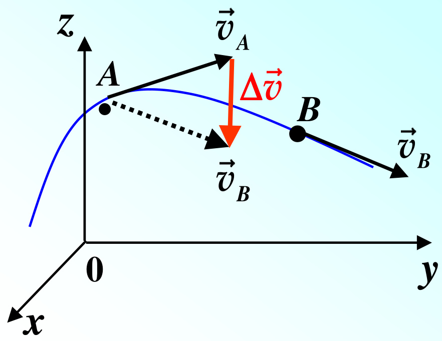  

平面曲线运动的自然坐标系：  

速度：v ve加速度：  

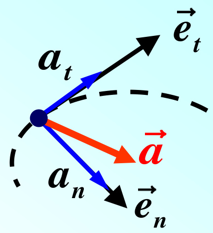  

a at et an  en at an  
$\stackrel{\triangledown}{\vec{a}}=\frac{\mathrm{d}\vec{v}}{\mathrm{d}t}\,=\frac{\mathrm{d}(v\vec{e_{t}})}{\mathrm{d}t}\,=\frac{\mathrm{d}v}{\mathrm{d}t}\,\vec{e_{t}}+v\,\frac{\mathrm{d}\vec{e_{t}}}{\mathrm{d}t}$ at 二 dv dt 反映速度大小的变化v 反映速度方向的变化  

物理意义：可从直线运动和匀速圆周运动两特例看。  

3.  质点运动学的两类基本问题（1） 已知运动方程，求速度、加速度  

$$
{\vec{v}}={\frac{\mathrm{d}{\vec{r}}}{\mathrm{d}t}}\qquad{\vec{a}}={\frac{\mathrm{d}{\vec{v}}}{\mathrm{d}t}}
$$

已知运动方程，可用求导的方法求速度、加速度。  

（2）已知加速度，求速度、运动方程和轨迹方程  

$$
\begin{array}{l l l}{{\displaystyle{\bf\Gamma}=\frac{\mathrm{d}\vec{v}}{\mathrm{d}t}\Rightarrow\int_{\vec{v}_{0}}^{\vec{v}}\mathrm{d}\vec{v}={\int_{t_{0}}^{t}\vec{a}\mathrm{d}t\,\Rightarrow\vec{v}=\vec{v}_{0}+}}\\ {{\displaystyle{\bf\Gamma}=\frac{\mathrm{d}\vec{r}}{\mathrm{d}t}\,\Rightarrow\int_{\vec{r}_{0}}^{\vec{r}}\mathrm{d}\vec{r}={\int_{t_{0}}^{t}\vec{v}\mathrm{d}t\,\Rightarrow\vec{r}=\vec{r_{0}}+}}\end{array}
$$

已知加速度和运动的初始条件，可用积分的方法求速度、运动方程和轨迹方程。  

2x t例: 一质点运动方程为：y t 2t求：（1）质点运动轨迹方程;  

（2）x 4时（t >0）粒子的速度、加速度。  

解：（1）消去t ，得运动轨迹方程：y x2 2x  

$$
\vec{a}=\!a_{x}\vec{i}+\!a_{y}\vec{j}
$$

例: 一质点沿 $\pmb{x}$ 轴作加速运动: $\pmb{t}=\pmb{0}\mathbb{H}\mathbf{\vec{y}}$ ， x =x0 ，v =v0  

（1） $a=-k v$ , 求任意时刻的速度 $v(t)$ 和位置 $x(t)$ ；  

（2） $a=k x$ , 求任意位置的速度 $v(x).$ 。  

解: （1）讨论一维运动时，矢量符号可用正负号代替  

$$
\left\{\begin{array}{l l}{a=-k v}\\ {a={\frac{\mathrm{d}v}{\mathrm{d}t}}}\end{array}\right.
$$

$$
\left\{\begin{array}{l l}{\Rightarrow v=v_{0}\mathrm{e}^{-k t}}\\ {v=\displaystyle\frac{\mathrm{d}x}{\mathrm{d}t}}\end{array}\right.
$$

$$
\Rightarrow\int_{x_{0}}^{x}\mathrm{d}x=\int_{0}^{t}v_{0}\mathrm{e}^{-k t}\mathrm{d}t
$$

$$
\Rightarrow x=x_{0}+{\frac{v_{0}}{k}}(1-\mathrm{e}^{-k t})
$$

例: 一质点沿 $\pmb{x}$ 轴作加速运动: $\pmb{t}=\pmb{0}\mathbb{H}\pmb{\nu}\mathbf{j}$ ， x =x0 ，v =v0  

（1） $a=-k v$ , 求任意时刻的速度 $v(t)$ 和位置 $x(t)$ ；  

（2） $a=k x$ , 求任意位置的速度 $v(x).$ 。  

解: （2）  

$$
\Rightarrow v=\sqrt{v_{0}^{2}+k(x^{2}-x_{0}^{2})}
$$

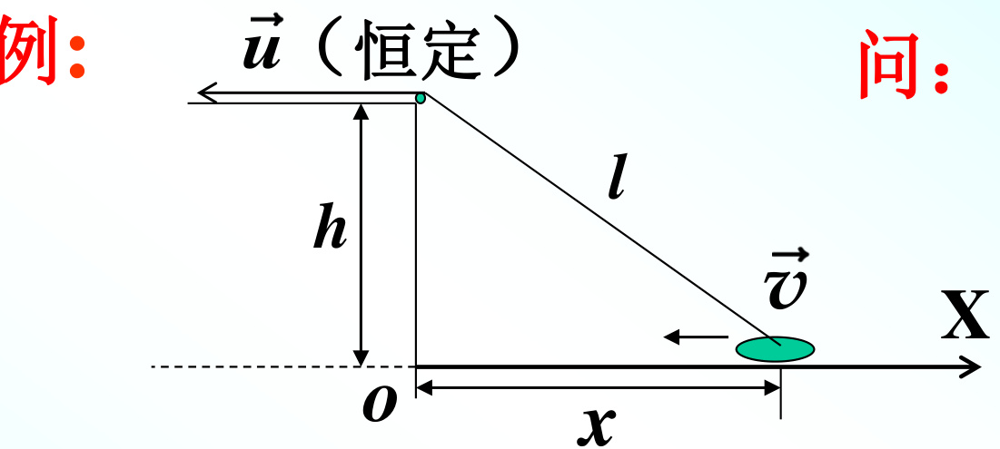  

$$
\left\{\begin{array}{l l}{\displaystyle v\!=\!\frac{\mathrm{d}x}{\mathrm{d}t}\,\left(\!<\mathbf{0}\right)}\\ {\displaystyle u\!=\!\frac{\mathrm{d}l}{\mathrm{d}t}\,\left(\!<\mathbf{0}\right)}\\ {\displaystyle x^{2}\!+\!h^{2}\!=\!l^{2}\Rightarrow\!2x\,\frac{\mathrm{d}x}{\mathrm{d}t}\!=\!2l\,\frac{\mathrm{d}l}{\mathrm{d}t}}\end{array}\right.
$$

$$
\Rightarrow\!\frac{v}{u}\!=\!\frac{l}{x}\!>\!1\Rightarrow v\!>\!u
$$

（1） u , v 哪个大？（2） 船是加速还是减速？  

（2）判断 $\vec{v}$ , $\vec{a}$ 是否同向$x v=l u$   
$\begin{array}{r l}&{\int_{-\infty}^{\infty}\displaystyle\frac{\mathrm{d}x}{\mathrm{d}t}v+x\displaystyle\frac{\mathrm{d}v}{\mathrm{d}t}\!=\!\frac{\mathrm{d}l}{\mathrm{d}t}u+l\displaystyle\frac{\mathrm{d}u}{\mathrm{d}t}}\\ &{\qquad\displaystyle\frac{\mathrm{d}u}{\mathrm{d}t}\!=\!0}\\ &{\qquad\Rightarrow v^{2}+x a=u^{2}}\\ &{\qquad\Rightarrow a=\displaystyle\frac{u^{2}-v^{2}}{x}<0}\end{array}$ 而 $v<0$ 故加速。  

例: 一飞机在高空A点时的水平速率v =1940 km/h,沿近似圆弧的曲线俯冲到B点,vB=2192 km/h,经历时间为3 s,设飞机从A到B的过程可视为匀变速圆周运动,圆弧半径 $r=3$ .5 km.  

求：（1）飞机在点B的加速度；（2）飞机由点A到点B所经历的路程。  

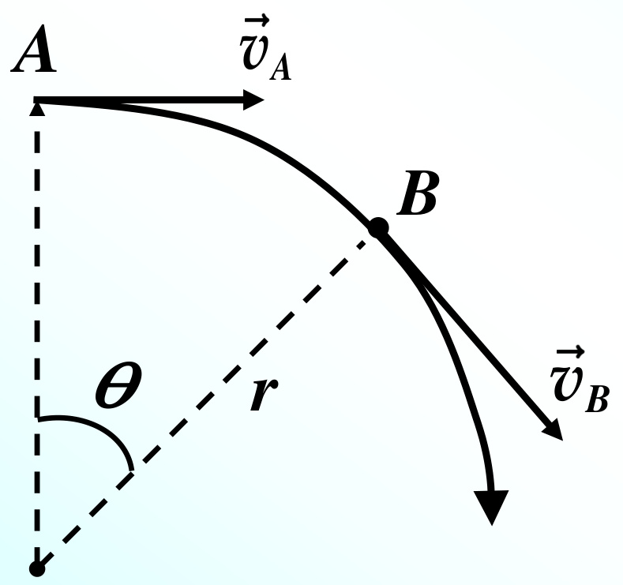  

解： （1）匀变速圆周运动中切向加速度大小为常量  

$$
\pmb{a}_{t}=\frac{\mathrm{d}\boldsymbol{v}}{\mathrm{d}t}\Rightarrow\int_{v_{A}}^{v_{B}}\mathrm{d}v=\int_{0}^{t_{B}}\pmb{a}_{t}\mathrm{d}t
$$

B点的法向加速度：  

$$
a_{n}={\frac{v_{_{B}}^{2}}{r}}\,{=}\,106\;\mathrm{m/s}^{2}
$$

所以B点总加速度大小：  

$$
\pmb{a}\,{=}\,\sqrt{\pmb{a}_{t}^{2}\,{+}\pmb{a}_{n}^{2}}\,{=}\,109\,\mathrm{m/\,s}^{2}
$$

方向： $\alpha\!=\!\arctan{\frac{a_{t}}{a_{n}}}\!=\!12,$ .4  

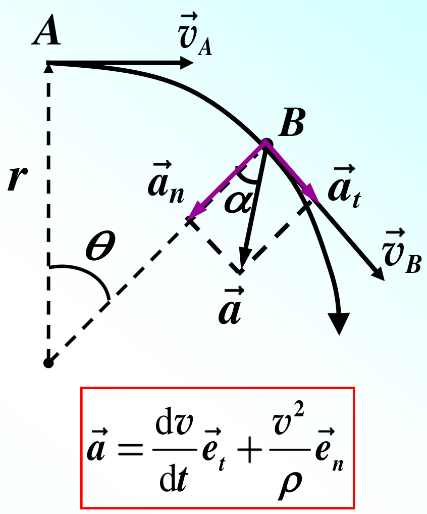  

（2） 从A到B所经历的路程  

$$
\left\{\begin{array}{l l}{\displaystyle v=\frac{\mathrm{d}s}{\mathrm{d}t}\Rightarrow s=\int_{\mathfrak{o}}^{t_{b}}v\mathrm{d}t}\\ {\displaystyle a_{t}=\frac{\mathrm{d}v}{\mathrm{d}t}\Rightarrow\int_{v_{A}}^{v}\mathrm{d}v=\int_{\mathfrak{o}}^{t}a_{t}\mathrm{d}t}\end{array}\right.
$$

$$
s=\int_{0}^{t_{B}}(v_{_A}+\mathbf{\boldsymbol{a}}_{t}t)\mathrm{d}t=v_{_A}t_{B}+\frac{1}{2}\mathbf{\boldsymbol{a}}_{t}t_{B}^{2}
$$

$$
\mathbf{\left|}_{\mathbf{\Phi}_{t_{B}=3\textrm{s}}}=1722\textrm{m}
$$

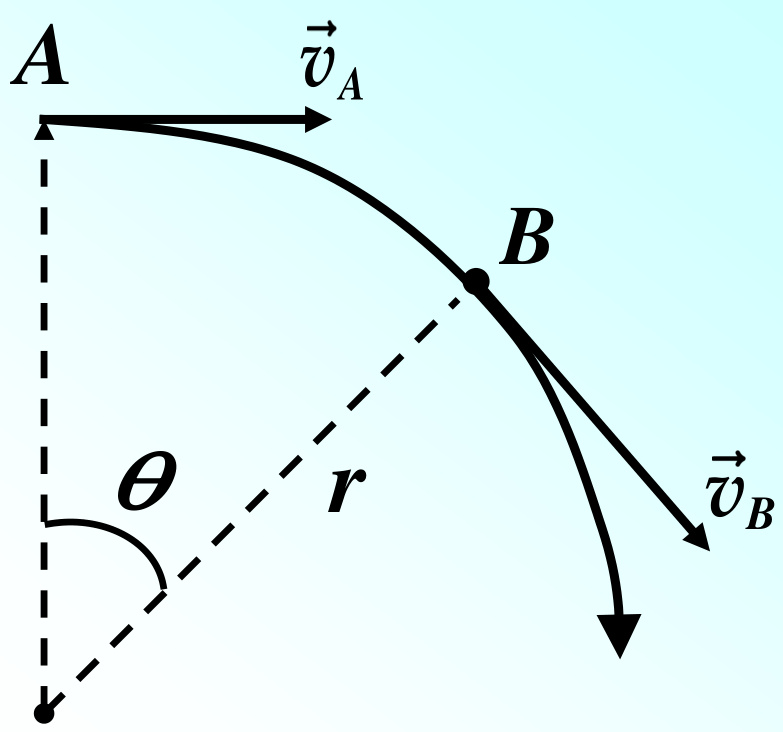  

# 第 4 节 相对运动  

同一运动质点在不同的参考系中有不同的速度，从相对运动的关系可求出同一质点在不同参考系中的速度之间的关系。  

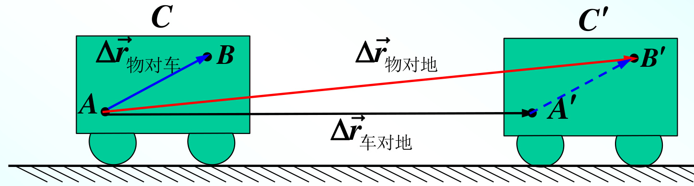  

以车为参考系，物体的位移为r物对车 ；以地面为参考系，车的位移为 r车对地，物体的位移为 r物对地  

因此，物体的速度为 （地面参考系）  

$$
\underset{\rightarrow0}{\mathbf{m}}\frac{\Delta\vec{r}_{\!\mathrm{*}y\!\mathrm{3}\!\mathrm{*}\!\mathrm{]}\!\mathrm{\#}}}{\Delta t}{=}\operatorname*{lim}_{\Delta t\rightarrow0}\frac{\Delta\vec{r}_{\!\mathrm{*}y\!\mathrm{3}\!\mathrm{*}\!\mathrm{]}\!\mathrm{\#}}}{\Delta t}{+}\operatorname*{lim}_{\Delta t\rightarrow0}\frac{\Delta\vec{r}_{\!\mathrm{*}y\!\mathrm{3}}}{\Delta t}
$$

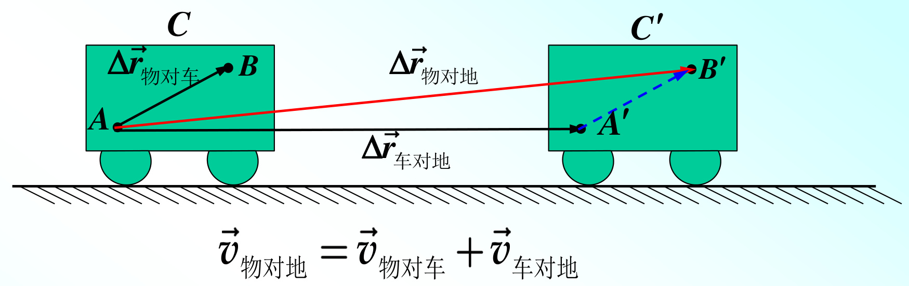  

通常把我们认定为静止的参考系（如地面）称为静止参考系，把物体相对于静止参考系的速度称为“绝对速度”；把物体相对于运动参考系的速度称为“相对速度”；把运动参考系相对于静止参考系的速度称为“牵连速度”  

推广到一般情况，设B、C代表两个平动参考系，A代表运动质点，则  

长度和时间的测量  

以上体现的是绝对时空观：空间的测量和时间的测与运动无关。不同参考系中的尺子和钟是完全一样的。  

例：一无风的下雨天，一列火车以 v1=20.0 m/s 的速度匀速前进。车内的旅客看见窗外的雨滴和铅垂线方向成75度角下落。  

求：雨滴下落的速度 $v_{2}.$ .（设雨滴匀速落向地面）  

解：  

v1是火车相对地面的速度v2是雨滴相对地面的速度$\vec{v}_{2}=\vec{v}_{\scriptscriptstyle\overrightarrow{\mathrm{H}}\scriptscriptstyle\ddag}+\vec{v}_{1}$  

$$
\Rightarrow v_{2}=v_{1}\cdot\mathrm{cot}75^{\circ}=5.36\:\mathrm{m/s}
$$

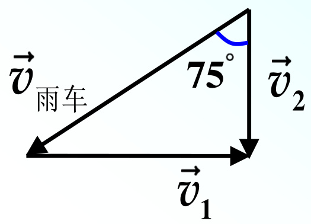  

例：一行驶的货车遇到大雨。雨滴相对地面竖直下落,速度为5 m/s。车厢里紧靠挡板水平地放有长为L＝1 m的木板。如果木板的上表面距挡板最高端的距离 $h\!=\!1\;\!\mathrm{m},$ 问货车至少要以多大的速度行驶, 才能使木板不致淋雨?  

解：  

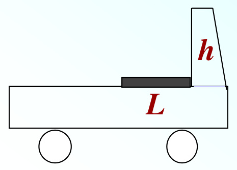  

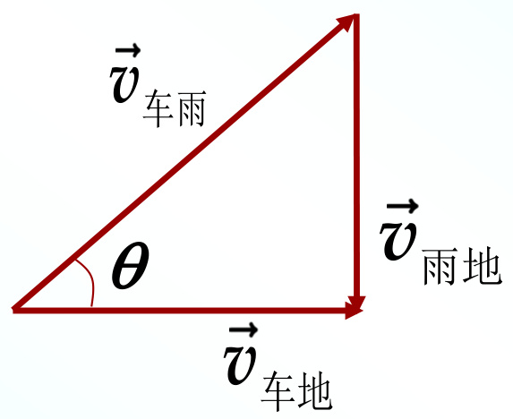  

  

# 第2章 牛顿运动定律  

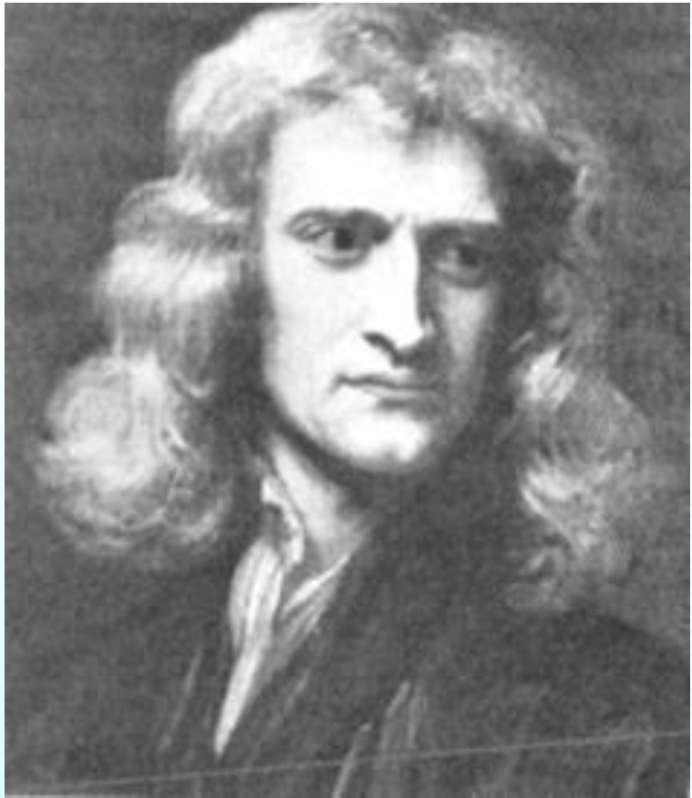  
牛顿 Issac Newton  

英国物理学家，经典物理学的奠基人。他对力学、光学、热学、天文学和数学等学科都有重大发现，其代表作《自然哲学的数学原理》 是力学的经典著作。牛顿是近代自然科学奠基时期具有集前人之大成的贡献的伟大科学家。  

# 第1节 牛顿运动定律  

1. 牛顿第一定律（惯性定律）  

任何物体都保持静止或沿一条直线作匀速运动的状态，除非有力加于其上迫使它改变这种状态。  

任何物体都有保持运动状态不变的性质，即惯性。它是物质的固有属性；  

力施加于物体上的作用是使其改变运动状态；  

牛顿第一定律成立的参考系叫惯性参考系，简称惯性系；牛顿第一定律不成立的参考系叫非惯性系。  

事实上，不存在严格意义上的惯性系。最常用的惯性系是地球，在一般的工程技术问题中，地球（或者说地面）是一个足够精确的惯性系。  

# 2. 牛顿第二定律  

运动的改变和所加的力成正比；并且发生在这力所沿的直线的方向上。  

运动：物体（质点）的质量与速度的乘积，即动量  

$$
\vec{p}=m\vec{v}
$$

运动的“改变”：动量对时间的变化率动量对时间的变化率与（动）力成正比  

$$
{\vec{F}}={\frac{\mathrm{d}{\vec{p}}}{\mathrm{d}t}}={\frac{\mathrm{d}(m{\vec{v}})}{\mathrm{d}t}}=m\,{\frac{\mathrm{d}{\vec{v}}}{\mathrm{d}t}}+{\vec{v}}\,{\frac{\mathrm{d}m}{\mathrm{d}t}}
$$

dm dv m为常量时： =0= F =m ma dt dt  

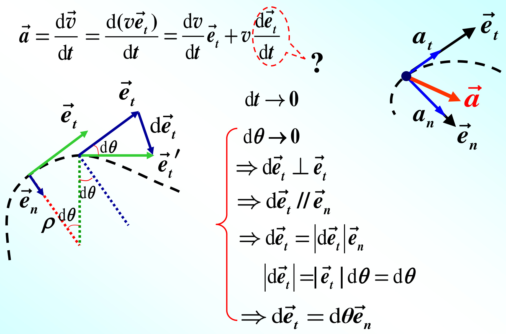  

$$
{\frac{|{\vec{e}}_{t}^{}}{\mathrm{\hbar}t}}\!=\!{\frac{\mathrm{d}\theta}{\mathrm{d}t}}{\vec{e}}_{n}\!=\!{\frac{\rho\,\mathrm{d}\theta}{\rho\,\mathrm{d}t}}{\vec{e}}_{n}=\!{\frac{1}{\rho\,\mathrm{\Delta}\mathrm{d}t}}{\vec{e}}_{n}=\!{\frac{v}{\rho}}
$$

